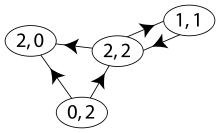

# Graph

Imagine a graph with as the following:
```
1 -- 0 -- 4
|
5 -- 6
|  / | \
| /  |   \
2 -- 3 -- 7
```

\subsubsection{Typical Implementation - Adjacency List}

An adjacency list is created with an array of lists. Size of the array is equal to the number of vertices. Each entry
represents the list of vertices adjacent to the $i^{th}$ vertex. Each node maintains a list of all its adjacent edges,
then, for each node, you could discover all its neighbors by traversing its adjacency list just once in linear time.

```
| 0 | -- 1 -- 4
| 1 | -- 0 -- 5
| 2 | -- 3 -- 5 -- 6
| 3 | -- 2 -- 6 -- 7
| 4 | -- 0
| 5 | -- 1 -- 2 -- 6
| 6 | -- 2 -- 3 -- 5 -- 7
| 7 | -- 3 -- 6
```

\subsubsection{Typical Implementation - Adjacency Matrix}

The adjacency information can also transform into matrix form with the convention followed here (for undirected graphs)
is that each edge adds 1 to the appropriate cell in the matrix, and each loop adds 2. For each node, you have to
traverse an entire row of length V in the matrix to discover all its outgoing edges.

```
0, 1, 0, 0, 1, 0, 0, 0
1, 0, 0, 0, 0, 1, 0, 0
0, 0, 0, 1, 0, 1, 1, 0
0, 0, 1, 0, 0, 0, 1, 1
1, 0, 0, 0, 0, 0, 0, 0
0, 1, 1, 0, 0, 0, 1, 0
0, 0, 1, 1, 0, 1, 0, 1
0, 0, 0, 1, 0, 0, 1, 0
```

In addition, a "visited" array that we’ll use to keep track of which vertices have been visited.

\subsubsection{Typical Implementation - Graph based}
```java
class Graph  {
    private int numOfVertices;   //No. of vertices
    private List<Integer> adj[]; //Adjacency List
    private boolean[] visited;   //visited mark for each vertex

    // Constructor
    public Graph(int num) {
        numOfVertices = num;
        adj = new LinkedList[v];
        for (int i=0; i<numOfVertices; ++i) {
            adj[i] = new LinkedList();
        }
    }
    ...
}
```

There is an alternative implementation to represent per node with a list of adjacent nodes.
\subsubsection{Typical Implementation - per Node based}
```java
class Node {
    public int val;
    public List<Node> neighbors;
    private boolean visited;     //visited mark for the vertex

    public Node(int _val, List<Node> _neighbors) {
        val = _val;
        neighbors = _neighbors;
    }
    ...
}
```

### Depth First Traversal
A depth first traversal without labeling the visited node usually ends up in exponential time complexity. There will be
many subproblems being reevaluated (which were visited in past). Thus, the time complexity is $O(2^{h+1} - 1)$ (as a
full binary tree)

If your graph is implemented as an adjacency matrix, then, for each node, you have to traverse an entire row of length
V in the matrix to discover all its outgoing edges. So, the complexity of DFS is $O(|V| * |V|) = O(|V|^2)$.

If your graph is implemented using adjacency lists, wherein each node maintains a list of all its adjacent edges,
then, for each node, you could discover all its neighbors by traversing its adjacency list just once in linear time.
For a directed graph, the sum of the sizes of the adjacency lists of all the nodes is E (total number of edges). So, the
complexity of DFS is O(V) + O(E) = O(V + E). For an undirected graph, each edge will appear twice. Once in the adjacency
list of either end of the edge. So, the overall complexity will be $O(|V|) + O (2\cdot |E|) = O(|V + E|)$.

#### Algorithm
dfs \@ref(dfs)

\subsubsection{Typical Implementation - Java}
```java
void helper(int node, boolean visited[]) {
    // Mark the current node as visited and print it
    visited[node] = true;

    // Recur for all the vertices adjacent to this vertex
    for(Integer adjNode: adj[node]) {
        if (!visited[adjNode]) {
            helper(adjNode, visited);
        }
    }
}

// The function to do DFS traversal. It uses recursive DFSUtil()
void dfs(int root) {
    // Mark all the vertices as not visited(set as
    // false by default in java)
    boolean visited[] = new boolean[numOfVertices];

    helper(root, visited);
}
```

### Bread First Traversal
For every single vertex in the graph, we will end up looking at its neighboring nodes only once (directed graph) or
twice (undirected graph). The time complexity for both a directed and undirected graph is the sum of the vertices and
their edges as represented by the graph in its adjacency list representation, or $O(|V| + |E|)$

The power of using breadth-first search to traverse through a graph is that it can easily tell us the shortest way to
get from one node to another.

#### Algorithm
 bfs \@ref(bfs)

\subsubsection{Typical Implementation - Java}
```java
class Graph  {
    private int numOfVertices;   // No. of vertices
    private LinkedList<Integer> adj[]; //Adjacency Lists

    ...

    void traversal(Integer root)  {
        // Mark all the vertices as not visited(By default
        // set as false)
        boolean visited[] = new boolean[numOfVertices];

        // Create a queue for BFS
        Queue<Integer> queue = new LinkedList<Integer>();

        // Mark the current node as visited and enqueue it
        visited[root] = true;
        queue.offer(root);

        while (queue.size() != 0) {
            // Dequeue a vertex from queue and print it
            Integer node = queue.poll();

            // Get all adjacent vertices of the dequeued vertex s
            // If a adjacent has not been visited, then mark it
            // visited and enqueue it
            for(Integer adjNode : adj[node]) {
                if (!visited[adjNode] && !queue.contain(adjNode)) {
                    queue.offer(adjNode);
                }
            }
        }
    }
}
```

### Topological Sorting
A traversal algorithm for \textbf{Directed Acyclic Graph (DAG)} is a linear ordering of vertices such that for every
directed edge $[u,v]$, vertex u comes before v in the ordering.

\subsubsection{By DFS}
In DFS implementation of Topological Sort we focused on sink vertices, i.e, vertices with zero out-going edges, and then
at last had to reverse the order in which we got the \textbf{sink vertices} (which we did by using a stack, which is a
Last In First Out data structure). A DAG has to have at least one sink vertex which is the vertex which has no outbound
edges. In DFS we print the nodes as we see them, which means when we print a node, it has just been discovered but not
yet processed, which means it is in the Visiting state. So DFS gives the order in which the nodes enter the Visiting
state and not the Visited state. For topological sorting we need to have the order in which the nodes are completely
processed, i.e, the order in which the nodes are marked as Visited. Because when a node is marked Visited then all of
its child node have already been processed, so they would be towards the right of the child nodes in the topological
sort, as it should be.

For example, in the given graph, the vertex ‘5’ should be printed before vertex ‘0’, but unlike DFS, the vertex ‘4’
should also be printed before vertex ‘0’.

```
5 -> 0 <- 4
|         |
v         v
2 -> 3 -> 1
```

In topological sorting, we use a temporary stack. We don’t print the vertex immediately, we first recursively call
topological sorting for all its adjacent vertices, then push it to a stack. Finally, print contents of stack.  The
final sequence is [5, 4, 2, 3, 1, 0]

#### Algorithm
    topological \@ref(topological), dfs \@ref(dfs)

\subsubsection{Typical Implementation - Java Code}
```java
void helper(Integer v, Stack stack) {
    visited[v] = true;

    // Recur for all the vertices adjacent to this
    // vertex
    Iterator<Integer> it = adj[v].iterator();
    while (it.hasNext()) {
        Integer adjNode = it.next();

        if (!visited[adjNode])  {
            helper(adjNode, visited, stack);
        }
    }

    // Push current vertex to stack which stores result
    stack.push(new Integer(v));
}

List<Integer> topologicalSort(Graph graph) {
    Stack<Integer> stack = new Stack<>();
    List<Integer> result = new ArrayList<>();

    // Call the recursive helper function to store
    // Topological Sort starting from all vertices
    // one by one
    for (int i = 0; i < numOfVertices; i++) {
        if (visited[i] == false)  {
            helper(i, visited, stack);
        }
    }

    //Now the stack contains the topological sorting of the graph
    for (Integer vertex : stack) {
        result.add(stack.pop());
    }

    return result
}
```

\subsubsection{By BFS}
In BFS implementation of the Topological sort we do the opposite: We look for for edges with no inbound edges
(\textbf{source vertex}). And consequently in BFS implementation we don’t have to reverse the order in which we get the
vertices, since we get the vertices in order of the topological ordering. We use First-In-First-Out data structure
Queue in this implementation. We just search for the vertices with zero indegrees and put them in the queue till
we have processed all the vertices of the graph. Polling vertices from the queue one by one give the topological sort
of the graph. Lastly check if the result set does not contain all the vertices that means there is at least one cycle
in the graph. That is because the indegree of those vertices participating in the loop could not be made 0 by
decrementing.



#### Algorithm
topological \@ref(topological), bfs \@ref(bfs)

\subsubsection{Typical Implementation - Java Code}
```java
public List topological_sort_bfs(int[][] graph) {
    List<Integer> result = new ArrayList<>();
    int[] indegree = new int[numOfVertices];

    // compute the indegree of all the vertices in the graph
    // For edge (0,1), indegree[1]++;
    for (int i = 0; i < numOfVertices; i++) {
        for(Integer vertex : adj[i]) {
            indegree[vertex]++;
        }
    }

    Queue<Integer> queue = new LinkedList<>();

    // initialize the queue with all the vertices with no inbound edges
    for (Integer vertex = 0; index < numOfVertices; index++) {
        if (indegree[vertex] == 0) {
            queue.offer(vertex);
        }
    }

    while (!queue.isEmpty()) {
        Integer vertex = queue.poll();
        result.add(vertex);

        // now disconnect vertex1 from the graph
        // and decrease the indegree of the other end of the edge by 1
        for (Integer adjVertex : adj[i]) {
            indegree[adjVertex]--;
            if (indegree[adjVertex] == 0) {
                queue.offer(adjVertex);
            }
        }
    }

    // check if the graph had a cycle / loop
    if (result.size() != numOfVertices) {
        return new ArrayList<Integer>();
    }
    return result;
}
```


## Graph Serialization / /

### Description
Given the a node to a Graph, represent that Graph as a String in such a way that it may be  translated back to a
Graph using the generated String  A Node contains an integer value and all of the node’s neighbors.
### Example
N.A.

### Solution
#### Walkthrough
We use BFS to traverse the graph with a visited Set to avoid running into cycle, and add child node only on unvisited
adjacent nodes. For serialization, we simply place current val as first element and adjacent nodes val at the same
line for the following elements, i.e. current, adj1, adj2, adj3, ..etc. Therefore, there will be two occurrence
for each node-pair (edges) in the serialized content. For deserialization, it is easier by first splitting the lines
and splitting by the dilimter ',' and finally reassemble the graph data structure.

#### Analysis
The time complexity for both a directed and undirected graph is the sum of the vertices and
their edges as represented by the graph in its adjacency list representation, or $O(|V| + |E|)$

```java
Graph:
1
Serialized Content:
1
```

```java
Graph:
1 - 2
|   |
3 - 5
|
4
Serialized Content:
1, 2, 3
2, 1, 5
3, 1, 5, 4
4, 3
5, 2, 3
```

#### Algorithm
 bfs \@ref(bfs)

### Java Code
```java
class Graph {
    private int numOfVertices; // No. of vertices
    private LinkedList<Integer> adj[]; //Adjacency Lists

    // Constructor
    Graph(int num) {
        numOfVertices = num;
        adj = new LinkedList[numOfVertices];
        for (int i = 0; i < numOfVertices; ++i) {
            adj[i] = new LinkedList();
        }
    }

    // Function to add an edge into the graph from v1 to v2
    public void addEdge(int v1, int v2) {
        adj[v1].add(v2);
    }

    public String serialize(Integer rootId) {
        StringBuilder stringBuilder = new StringBuilder();

        if(adj.length <= 0) {
            return "";
        }

        boolean visited[] = new boolean[numOfVertices];
        Queue<Integer> queue = new LinkedList<Integer>();

        // Mark the current node as visited and enqueue it
        queue.offer(rootId);

        while (queue.size() != 0) {
            Integer nodeId = queue.poll();
            visited[nodeId]=true;

            stringBuilder.append(serializeNode(nodeId));

            // Get all adjacent vertices of the dequeued vertex s
            // If a adjacent has not been visited, then mark it
            // visited and enqueue it
            for(Integer adjNodeId : adj[nodeId]) {
                if (!visited[adjNodeId] && !queue.contains(adjNodeId)) {
                    queue.offer(adjNodeId);
                }
            }
        }

        return stringBuilder.toString();
    }

    private String serializeNode(int nodeId) {
        StringBuilder sb = new StringBuilder();

        //serialize node and adjacency nodes
        sb.append(nodeId);
        for(Integer adjNodeId: adj[nodeId]) {
            sb.append(",");
            sb.append(adjNodeId);
        }
        sb.append("\r\n");

        return sb.toString();
    }

    public Graph deserialize(String input) {
        String[] lines = input.split("\r\n");
        Graph graph = new Graph(lines.length);

        for(String line: lines) {
            String[] nodes = line.split(",");

            if(nodes.length > 1) {
                int srcNodeId = Integer.parseInt(nodes[0]);

                //there are adjacent nodes
                for(int j = 1; j < nodes.length; j++) {
                    Integer dstNodeId = Integer.valueOf(nodes[j]);
                    graph.addEdge(srcNodeId, dstNodeId);
                }
            }
        }

        return graph;
    }
}
```


## Distance of nearest cell having 1 in a binary matrix

### Description
Given a binary matrix of N x M, containing at least a value 1. The task is to find the distance of nearest 1 in the
matrix for each cell. The distance is calculated as $|i_1 - i_2| + |j_1 - j_2|$, where $i_1, j_1$ are the row number
and column number of the current cell and $i_2, j_2$ are the row number and column number of the nearest cell having
value 1.

### Example
Input:
```java
0, 0, 0, 1
0, 0, 1, 1
0, 1, 1, 0
```

Output:
```java
3, 2, 1, 0
2, 1, 0, 0
1, 0, 0, 1
```
### Solution
#### Walkthrough
Consider each cell as a node and each boundary between any two adjacent cells be an edge. Number each cell from 1 to
N*M. Now, push all the node whose corresponding cell value is 1 in the matrix in the queue. Apply BFS using this queue
to find the minimum distance of the adjacent node.

#### Analysis

    *  Create a graph with adjacency list for all nodes from 1 to rows * cols. Time complexity is O(rows * cols)
    *  Create an empty queue and 1 dimensional array of size (rows * cols) for visited[] and distance (init Integer.MAX)
Time complexity is O(rows * cols)
    *  For all nodes in the original matrix being 1, insert the associated node id into the queue and set the
distance to 0.
    *  Perform a BFS traversal of graph using above created queue. In BFS, we first explore immediate adjacent of all
1’s, then adjacent of adjacent and determine the minimum distance. Time complexity is O(rows * cols) since all elements
will be visited once.

Thus, the overall time complexity is O(rows * cols)

#### Algorithm
 bfs \@ref(bfs)

### Java Code
```java
class Graph {
    private int numOfVertices; // No. of vertices
    private LinkedList<Integer> adj[]; //Adjacency Lists

    // Constructor
    Graph(int[][] matrix) {
        int rows = matrix.length;
        int cols = matrix[0].length;

        if(matrix.length == 0) {
            return;
        }
        numOfVertices = rows * cols;
        adj = new LinkedList[numOfVertices];

        for (int i = 0; i < numOfVertices; ++i) {
            adj[i] = new LinkedList();
        }
    }

    // Function to add an edge into the graph from v1 to v2
    public void addEdge(int src, int dst) {
        adj[src].add(dst);
    }

    public void fillAdjacency(int[][] matrix) {
        int rows = matrix.length;
        int cols = matrix[0].length;

        for(int i = 0; i < rows; i++) {
            for(int j = 0; j < cols; j++) {
                int srcNodeId = this.computeNodeId(i, j, cols);
                int dstNodeId = -1;

                //adding left or right neighbor nodes, if there are any (cols > 1)
                if(cols > 1) {
                    if (j == 0) {
                        dstNodeId = this.computeNodeId(i, j + 1, cols);
                        this.addEdge(srcNodeId, dstNodeId);
                    } else if (j == cols - 1) {
                        dstNodeId = this.computeNodeId(i, j - 1, cols);
                        this.addEdge(srcNodeId, dstNodeId);
                    } else {
                        dstNodeId = this.computeNodeId(i, j - 1, cols);
                        this.addEdge(srcNodeId, dstNodeId);
                        dstNodeId = this.computeNodeId(i, j + 1, cols);
                        this.addEdge(srcNodeId, dstNodeId);
                    }
                }

                //adding above or below neighbor nodes, if there are any (rows > 1)
                if(rows > 1) {
                    if (i == 0) {
                        dstNodeId = this.computeNodeId(i + 1, j, cols);
                        this.addEdge(srcNodeId, dstNodeId);
                    } else if (i == rows - 1) {
                        dstNodeId = this.computeNodeId(i - 1, j, cols);
                        this.addEdge(srcNodeId, dstNodeId);
                    } else {
                        dstNodeId = this.computeNodeId(i - 1, j, cols);
                        this.addEdge(srcNodeId, dstNodeId);
                        dstNodeId = this.computeNodeId(i + 1, j, cols);
                        this.addEdge(srcNodeId, dstNodeId);
                    }
                }
            }
        }
    }

    private int computeNodeId(int i, int j, int cols) {
        // Example
        // [0][0] = 0 * 2 + 0 = 0
        // [0][1] = 0 * 2 + 1 = 1
        // [1][0] = 1 * 2 + 0 = 2
        // [1][1] = 1 * 2 + 1 = 3
        return i * cols + j;
    }


    private void init(Queue<Integer> queue, int[][] matrix, boolean[] visited, int[] dist) {
        //Traverse all matrix elements. If it is a 1, then insert associated node id into queue
        if(matrix.length == 0) {
            return;
        }

        int rows = matrix.length;
        int cols = matrix[0].length;

        for(int i = 0; i < rows; i++) {
            for (int j = 0; j < cols; j++) {
                int nodeId = computeNodeId(i, j, cols);

                if(matrix[i][j] == 1) {
                    queue.offer(nodeId);
                    visited[nodeId] = true;
                } else {
                    dist[nodeId] = Integer.MAX_VALUE;
                }
            }
        }
    }

    public int[] bfs(int[][] matrix) {
        int[] dist = new int[numOfVertices];
        boolean visited[] = new boolean[numOfVertices];

        Queue<Integer> queue = new LinkedList<Integer>();

        // Mark the current node as visited and enqueue it
        init(queue, matrix, visited, dist);

        while (queue.size() != 0) {
            Integer nodeId = queue.poll();

            // Get all adjacent vertices of the dequeued vertex s
            // If a adjacent has not been visited, then mark it
            // visited and enqueue it
            for (Integer adjNodeId : adj[nodeId]) {
                if (!visited[adjNodeId] ) {
                    //find minimum value among adjaNodeId and its neighbors + 1
                    dist[adjNodeId] = Math.min(dist[adjNodeId], dist[nodeId] + 1);

                    queue.offer(adjNodeId);
                    visited[adjNodeId] = true;
                }
            }
        }

        return dist;
    }
}
```


## Clone Graph / LeetCode 133 / Medium

### Description
Given a reference of a node in a connected undirected graph, return a deep copy (clone) of the graph. Each node in the
graph contains a val (int) and a list (List[Node]) of its neighbors.

### Example

### Solution - DFS
#### Walkthrough
Have a map as cache to store the mapping between original and new node. Recursively walk through the each adjacent node
and assign into the adjacency list if existed in cache; otherwise, recursively clone the node.

#### Analysis
Since each edge will appear twice. Once in the adjacency list of either end of the edge. So, the overall complexity
will be $O(|V|) + O(2 \cdot |E|) = O(|V + E|)$

#### Algorithm
dfs \@ref(dfs)

### Java Code
```java
//use this map to store original and cloned node.
//also act as visited[]
Map<Node, Node> map = new HashMap<>();

public Node cloneGraph(Node node) {
    map.put(node, new Node(node.val, new ArrayList<Node>()));

    for(Node neighbor: node.neighbors){
        if(map.containsKey(neighbor)) {
            //if neighbor is cloned
            Node cloneNode = map.get(node);
            Node cloneNeighbor = map.get(neighbor);
            cloneNode.neighbors.add(cloneNeighbor);
        } else {
            //recursively clone and add the neighbor
            Node cloneNode = map.get(node);
            cloneNode.neighbors.add(cloneGraph(neighbor));
        }
    }

    return map.get(node);
}
```

### Solution - BFS
#### Walkthrough
We use BFS to traverse the graph with a map cache to store the original and cloned node. This cache can only be used
as visited[].

#### Analysis
For every single vertex in the graph, we will end up visiting its neighboring nodes only twice. The time complexity is
the sum of the vertices and their edges as represented by the graph in its adjacency list representation: $O(|V| + |E|)$

#### Algorithm
bfs \@ref(bfs)

### Java Code
```java
public Node cloneGraph(Node root) {
    //use this map to store original and cloned node
    //also act as visited[]
    Map<Node, Node> map = new HashMap<>();
    Queue<Node> queue = new ArrayDeque<>();

    queue.offer(root);
    map.put(root, new Node(root.val, new ArrayList<>()));

    while (!queue.isEmpty()) {
        Node node = queue.poll();

        for (Node neighbor : node.neighbors) {
            // neighbor node is not yet cloned
            if (!map.containsKey(neighbor)) {
                map.put(neighbor, new Node(neighbor.val, new ArrayList<>()));
                queue.offer(neighbor);
            }

            //assign the mapping righ tafter
            Node cloneNode = map.get(node);
            Node cloneNeighbor = map.get(neighbor);
            cloneNode.neighbors.add(cloneNeighbor);
        }
    }

    return map.get(root);
}
```


## Course Schedule I / LeetCode 207 / Medium

### Description
There are a total of n courses you have to take, labeled from 0 to n-1.

Some courses may have prerequisites, for example to take course 0 you have to first take course 1, which is expressed
as a pair: [0,1]

Given the total number of courses and a list of prerequisite pairs, is it possible for you to finish all courses?

### Example
#### Example 1
Input: 2, [[1,0]]
Output: true
Explanation: There are a total of 2 courses to take.
To take course 1 you should have finished course 0. So it is possible.

#### Example 2
Input: 2, [[1,0],[0,1]]
Output: false
Explanation: There are a total of 2 courses to take.
To take course 1 you should have finished course 0, and to take course 0 you should
also have finished course 1. So it is impossible.

### Solution - Topological Sort via BFS
#### Walkthrough
This problem can be converted to finding if a graph contains a cycle using topological sort

#### Analysis
A BFS would cost $O(|V| + |E|)$

#### Algorithm
topological \@ref(topological), bfs \@ref(bfs)

### Java Code
```java
public boolean canFinish(int numCourses, int[][] prerequisites) {
    if(numCourses == 0 || prerequisites.length == 0){
        return true;
    }

    // counter for number of prerequisites
    int[] numPrereq = new int[numCourses];
    for(int i = 0; i < prerequisites.length; i++){
        numPrereq[prerequisites[i][0]]++;
    }

    //store courses that have no prerequisites
    Queue<Integer> queue = new LinkedList<Integer>();
        for(int i = 0; i < numCourses; i++){
        if(numPrereq[i] == 0){
            queue.offer(i);
        }
    }

    // store the topological sorting order
    List<Integer> order = new ArrayList<>();

    while(!queue.isEmpty()) {
        int vertex = queue.poll();
        order.add(vertex);

        for(int i = 0; i < prerequisites.length; i++){
            // if a course's prerequisite can be satisfied by a course in queue
            if(prerequisites[i][1] == vertex) {
                numPrereq[prerequisites[i][0]]--;

                if(numPrereq[prerequisites[i][0]] == 0) {
                    queue.offer(prerequisites[i][0]);
                }
            }
        }
    }

    return order.size() == numCourses;
}
```

### Solution - Topological Sort via DFS
#### Walkthrough

#### Analysis
A DFS would cost $O(|V| + |E|)$

#### Algorithm
topological \@ref(topological), dfs \@ref(dfs)

### Java Code
```java
public boolean canFinish(int numCourses, int[][] prerequisites) {
    if(numCourses == 0 || prerequisites.length == 0){
        return true;
    }

    //track state of visited courses
    // -1: VISITING
    //  1: VISITED
    int[] visited = new int[numCourses];

    // use the map to store what courses depend on a course
    // can transform into an adjcency list
    Map<Integer, List<Integer>> adjMap = new HashMap<>();
    for(int[] edge: prerequisites){
        if(adjMap.containsKey(edge[1])) {
            adjMap.get(edge[1]).add(edge[0]);
        } else {
            List<Integer> list = new ArrayList<Integer>();
            list.add(edge[0]);
            adjMap.put(edge[1], list);
        }
    }

    for(int i = 0; i < numCourses; i++) {
        if(!dfs(adjMap, visited, i)) {
            return false;
        }
    }

    return true;
}

private boolean dfs(Map<Integer, List<Integer>> adjMap, int[] visited, Integer vertex){
    if(visited[vertex] == -1) {
        return false;
    }
    if(visited[vertex] == 1) {
        return true;
    }

    visited[vertex] = -1;

    if(adjMap.containsKey(vertex)){
        for(Integer adjVertex: adjMap.get(vertex)){
            if(!dfs(adjMap, visited, adjVertex)) {
                return false;
            }
        }
    }

    visited[vertex] = 1;

    return true;
}
```


## Course Schedule II / LeetCode 210 / Medium 

### Description
There are a total of n courses you have to take, labeled from 0 to n-1.

Some courses may have prerequisites, for example to take course 0 you have to first take course 1, which is expressed
as a pair: [0,1]. Given the total number of courses and a list of prerequisite pairs, return the ordering of courses
you should take to finish all courses. There may be multiple correct orders, you just need to return one of them. If
it is impossible to finish all courses, return an empty array.

### Example

#### Example 1
Input: 2, [[1,0]]
Output: [0,1]

#### Example 2
Input: 4, [[1,0],[2,0],[3,1],[3,2]]
Output: [0,1,2,3] or [0,2,1,3]

### Solution - Topological Sort via BFS
#### Walkthrough
This problem can be converted to finding if a graph contains a cycle using topological sort

#### Analysis
A BFS would cost $O(|V| + |E|)$

#### Algorithm
topological \@ref(topological), bfs \@ref(bfs)

### Java Code
```java
public int[] findOrder(int numCourses, int[][] prerequisites) {
    //if there is no prerequisites, return a sequence of courses
    if(prerequisites.length == 0){
        int[] res = new int[numCourses];

        for(int i = 0; i < numCourses; i++){
            res[i] = i;
        }

        return res;
    }

    // counter for number of prerequisites
    int[] numPrereq = new int[numCourses];
    for(int i = 0; i < prerequisites.length; i++){
        numPrereq[prerequisites[i][0]]++;
    }

    //store courses that have no prerequisites
    Queue<Integer> queue = new LinkedList<Integer>();
    for(int i = 0; i < numCourses; i++){
        if(numPrereq[i] == 0){
            queue.offer(i);
        }
    }

    // store the topological sorting order
    List<Integer> order = new ArrayList<>();

    while(!queue.isEmpty()) {
        int vertex = queue.poll();
        order.add(vertex);

        for(int i = 0; i < prerequisites.length; i++){
            // if a course's prerequisite can be satisfied by a course in queue
            if(prerequisites[i][1] == vertex) {
                numPrereq[prerequisites[i][0]]--;

                if(numPrereq[prerequisites[i][0]] == 0) {
                    queue.offer(prerequisites[i][0]);
                }
            }
        }
    }

    int numOfPreReq = order.size();
    if(numOfPreReq == numCourses) {
        return toArray(order);
    } else {
        return new int[0];
    }
}

private int[] toArray(List<Integer> list) {
    int[] result = new int[list.size()];

    for(int i = 0; i < list.size(); i++) {
        int item = list.get(i);
        result[i] = item;
    }

    return result;
}
```


## Graph Validate Tree / LeetCode 261 / Medium

### Description
Given n nodes labeled from 0 to n - 1 and a list of undirected edges (each edge is a pair of nodes), check if these
edges form a valid tree.

### Example

### Solution - Topological Sorting via DFS
#### Walkthrough
This problem can be converted to finding the cycle from a graph using Topological Sorting

#### Analysis
A DFS would cost $O(|V| + |E|)$

#### Algorithm
topological \@ref(topological), dfs \@ref(dfs)

### Java Code - Topological Sorting via DFS
```java
public boolean validTree(int n, int[][] edges) {
    HashMap<Integer, ArrayList<Integer>> map = new HashMap<Integer, ArrayList<Integer>>();
    for(int i=0; i<n; i++){
        ArrayList<Integer> list = new ArrayList<Integer>();
        map.put(i, list);
    }

    for(int[] edge: edges){
        map.get(edge[0]).add(edge[1]);
        map.get(edge[1]).add(edge[0]);
    }

    boolean[] visited = new boolean[n];

    if(!helper(0, -1, map, visited))
        return false;

    for(boolean b: visited){
        if(!b)
            return false;
    }

    return true;
}

private boolean helper(int curr, int parent,
    HashMap<Integer, ArrayList<Integer>> map, boolean[] visited){
    if(visited[curr])
        return false;

    visited[curr] = true;

    for(int i: map.get(curr)){
        if(i!=parent && !helper(i, curr, map, visited)){
            return false;
        }
    }

    return true;
}
```

### Solution - Topological Sorting via BFS
#### Walkthrough
This problem can be converted to finding the cycle from a graph using Topological Sorting

#### Analysis
A BFS cost $O(|V| + |E|)$

#### Algorithm
topological \@ref(topological), bfs \@ref(bfs)

### Java Code - Topological Sorting via BFS
```java
public boolean validTree(int n, int[][] edges) {
    ArrayList<ArrayList<Integer>> list = new ArrayList<>();
        for(int i=0; i<n; i++){
        list.add(new ArrayList<>());
    }

    //build the graph
    for(int[] edge: edges){
        int a = edge[0];
        int b = edge[1];

        list.get(a).add(b);
        list.get(b).add(a);
    }

    //use queue to traverse the graph
    HashSet<Integer> visited = new HashSet<>();
    LinkedList<Integer> q = new LinkedList<>();
    q.offer(0);

    while(!q.isEmpty()){
        int head = q.poll();

        if(visited.contains(head)){
            return false;
        }

        visited.add(head);

        ArrayList<Integer> vList = list.get(head);
        for(int v: vList){
            if(!visited.contains(v)){
                q.offer(v);
            }
        }
    }

    if(visited.size()<n){
        return false;
    }

    return true;
}
```


