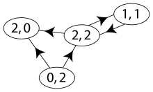

# Graph

### Undirected Graphs

Imagine a graph with as the following:
```
1 -- 0 -- 4
|
5 -- 6
|  / | \
| /  |   \
2 -- 3 -- 7
```

\subsubsection{Typical Implementation - Adjacency List}

An adjacency list is created with an array of lists. Size of the array is equal to the number of vertices. Each entry
represents the list of vertices adjacent to the $i^{th}$ vertex. Each node maintains a list of all its adjacent edges,
then, for each node, you could discover all its neighbors by traversing its adjacency list just once in linear time.

```
| 0 | -- 1 -- 4
| 1 | -- 0 -- 5
| 2 | -- 3 -- 5 -- 6
| 3 | -- 2 -- 6 -- 7
| 4 | -- 0
| 5 | -- 1 -- 2 -- 6
| 6 | -- 2 -- 3 -- 5 -- 7
| 7 | -- 3 -- 6
```

\subsubsection{Typical Implementation - Adjacency Matrix}

The adjacency information can also transform into matrix form with the convention followed here (for undirected graphs)
is that each edge adds 1 to the appropriate cell in the matrix, and each loop adds 2. For each node, you have to
traverse an entire row of length V in the matrix to discover all its outgoing edges.

```
0, 1, 0, 0, 1, 0, 0, 0
1, 0, 0, 0, 0, 1, 0, 0
0, 0, 0, 1, 0, 1, 1, 0
0, 0, 1, 0, 0, 0, 1, 1
1, 0, 0, 0, 0, 0, 0, 0
0, 1, 1, 0, 0, 0, 1, 0
0, 0, 1, 1, 0, 1, 0, 1
0, 0, 0, 1, 0, 0, 1, 0
```

In addition, a "visited" array that we’ll use to keep track of which vertices have been visited.

\subsubsection{Typical Implementation - Graph based}
```java
class Graph  {
    private int numOfVertices;   //No. of vertices
    private List<Integer> adj[]; //Adjacency List
    private boolean[] visited;   //visited mark for each vertex

    // Constructor
    public Graph(int num) {
        numOfVertices = num;
        adj = new LinkedList[v];
        for (int i=0; i<numOfVertices; ++i) {
            adj[i] = new LinkedList();
        }
    }
    ...
}
```

There is an alternative implementation to represent per node with a list of adjacent nodes.
\subsubsection{Typical Implementation - per Node based}
```java
class Node {
    public int val;
    public List<Node> neighbors;
    private boolean visited;     //visited mark for the vertex

    public Node(int _val, List<Node> _neighbors) {
        val = _val;
        neighbors = _neighbors;
    }
    ...
}
```

#### Graph Traversal

##### Depth First Traversal {#undirected-graph-dfs}
A depth first traversal without labeling the visited node usually ends up in exponential time complexity. There will be
many subproblems being reevaluated (which were visited in past). Thus, the time complexity is $O(2^{h+1} - 1)$ (as a
full binary tree)

If your graph is implemented as an adjacency matrix, then, for each node, you have to traverse an entire row of length
V in the matrix to discover all its outgoing edges. So, the complexity of DFS is $O(|V| * |V|) = O(|V|^2)$.

If your graph is implemented using adjacency lc-lists, wherein each node maintains a lc-list of all its adjacent edges,
then, for each node, you could discover all its neighbors by traversing its adjacency lc-list just once in linear time.
For a directed graph, the sum of the sizes of the adjacency lc-lists of all the nodes is E (total number of edges). So, the
complexity of DFS is O(V) + O(E) = O(V + E). For an undirected graph, each edge will appear twice. Once in the adjacency
lc-list of either end of the edge. So, the overall complexity will be $O(|V|) + O (2\cdot |E|) = O(|V + E|)$.

###### Implementation Steps

dfs \@ref(glossary-dfs)

\subsubsection{Typical Implementation - Java}
```java
void helper(int node, boolean visited[]) {
    // Mark the current node as visited and print it
    visited[node] = true;

    // Recur for all the vertices adjacent to this vertex
    for(Integer adjNode: adj[node]) {
        if (!visited[adjNode]) {
            helper(adjNode, visited);
        }
    }
}

// The function to do DFS traversal. It uses recursive DFSUtil()
void dfs(int root) {
    // Mark all the vertices as not visited(set as
    // false by default in java)
    boolean visited[] = new boolean[numOfVertices];

    helper(root, visited);
}
```

##### Bread First Traversal {#undirected-graph-bfs}
For every single vertex in the graph, we will end up looking at its neighboring nodes only once (directed graph) or
twice (undirected graph). The time complexity for both a directed and undirected graph is the sum of the vertices and
their edges as represented by the graph in its adjacency lc-list representation, or $O(|V| + |E|)$

The power of using breadth-first search to traverse through a graph is that it can easily tell us the shortest way to
get from one node to another.

###### Implementation Steps

 bfs \@ref(glossary-bfs)

\subsubsection{Typical Implementation - Java}
```java
class Graph  {
    private int numOfVertices;   // No. of vertices
    private LinkedList<Integer> adj[]; //Adjacency Lists

    ...

    void traversal(Integer root)  {
        // Mark all the vertices as not visited(By default
        // set as false)
        boolean visited[] = new boolean[numOfVertices];

        // Create a queue for BFS
        Queue<Integer> queue = new LinkedList<Integer>();

        // Mark the current node as visited and enqueue it
        visited[root] = true;
        queue.offer(root);

        while (queue.size() != 0) {
            // Dequeue a vertex from queue and print it
            Integer node = queue.poll();

            // Get all adjacent vertices of the dequeued vertex s
            // If a adjacent has not been visited, then mark it
            // visited and enqueue it
            for(Integer adjNode : adj[node]) {
                if (!visited[adjNode]) {
                    visited[adjNode] = true;
                    queue.offer(adjNode);
                }
            }
        }
    }
}
```

#### Union-Find (Disjoint Set Union) {#union-find}

Union-Find is a data structure that tracks a collection of elements partitioned into **disjoint (non-overlapping) sets**. It supports two core operations efficiently:

- **`find(x)`**: Which group does element `x` belong to? Returns the **root** (representative) of `x`'s set.
- **`union(x, y)`**: Merge the groups containing `x` and `y` into one group.

**Core Intuition:**

Think of it as managing friend circles. Everyone starts alone. When two people become friends, their circles merge. To check if two people are in the same circle, trace each person back to their circle's "leader" (root).

```
Initial:  [0] [1] [2] [3] [4]   ← 5 separate groups

union(0,1): [0,1] [2] [3] [4]
union(1,2): [0,1,2] [3] [4]
union(3,4): [0,1,2] [3,4]

find(0) == find(2)?  YES → same group
find(0) == find(3)?  NO  → different groups
```

**Internal Representation:**

Each element stores a `parent` pointer. The root of a tree is its own parent.

```
After union(0,1), union(1,2):

parent: [1, 2, 2, 3, 4]
         ↑  ↑  ↑
         0→1→2 (root)

Tree structure:
    2
    |
    1
    |
    0
```

##### Basic Implementation

```java
class UnionFind {
    int[] parent;

    UnionFind(int n) {
        parent = new int[n];
        for (int i = 0; i < n; i++) {
            parent[i] = i;  // each element is its own root
        }
    }

    int find(int x) {
        if (parent[x] != x) {
            return find(parent[x]);  // recurse up to root
        }
        return x;
    }

    void union(int a, int b) {
        int rootA = find(a);
        int rootB = find(b);
        if (rootA != rootB) {
            parent[rootA] = rootB;  // attach one root under the other
        }
    }
}
```

**Problem:** Without optimizations, `find()` can degrade to O(n) on a chain:

```
union(0,1), union(1,2), union(2,3), union(3,4)

parent: [1, 2, 3, 4, 4]

Tree (chain):
0 → 1 → 2 → 3 → 4
```

`find(0)` must traverse 4 hops. With n elements: O(n) per operation.

##### Optimization 1: Path Compression

During `find()`, make every node on the path point **directly to the root**. Flattens the tree for future queries.

```java
int find(int x) {
    if (parent[x] != x) {
        parent[x] = find(parent[x]);  // path compression: point directly to root
    }
    return parent[x];
}
```

**Before and after `find(0)` with path compression:**

```
Before:                After:
0 → 1 → 2 → 3 → 4    0 → 4
                       1 → 4
                       2 → 4
                       3 → 4
```

All future `find()` calls from 0, 1, 2, 3 take O(1).

##### Optimization 2: Union by Rank

Always attach the **shorter tree under the taller tree**. Keeps trees balanced.

```java
class UnionFind {
    int[] parent;
    int[] rank;  // approximate height of the subtree

    UnionFind(int n) {
        parent = new int[n];
        rank = new int[n];
        for (int i = 0; i < n; i++) {
            parent[i] = i;
            rank[i] = 0;
        }
    }

    int find(int x) {
        if (parent[x] != x) {
            parent[x] = find(parent[x]);  // path compression
        }
        return parent[x];
    }

    boolean union(int a, int b) {
        int rootA = find(a);
        int rootB = find(b);
        if (rootA == rootB) return false;  // already in same set

        // attach smaller rank tree under larger rank tree
        if (rank[rootA] < rank[rootB]) {
            parent[rootA] = rootB;
        } else if (rank[rootB] < rank[rootA]) {
            parent[rootB] = rootA;
        } else {
            parent[rootB] = rootA;
            rank[rootA]++;  // only grows when ranks are equal
        }
        return true;
    }
}
```

**Why return boolean from union?** Returning `false` when roots are equal means the two elements were **already connected** — useful for cycle detection.

##### Combined Complexity

With both path compression and union by rank:

- **Time**: O($\alpha$(n)) per operation, where $\alpha$ is the inverse Ackermann function — effectively O(1) for all practical inputs
- **Space**: O(n) for parent and rank arrays

##### When to Use Union-Find

| Problem Pattern | Example |
|---|---|
| Group elements by shared property | Accounts Merge |
| Detect cycles in undirected graph | Graph Valid Tree |
| Count connected components | Number of Connected Components |
| Check if two elements are in same group | Friend Circles |

**Key signal in problem statement:** "Two X belong together if they share Y" — this is almost always Union-Find.

#### Graph Cycle Detection in Undirected Graph {#undirected-graph-cycle-detection}

In an undirected graph, a cycle exists if during traversal we encounter a visited node that is **not the parent** of the current node. Since edges are bidirectional, we must track the parent to avoid false positives.

##### Approach 1: DFS with Parent Tracking

**Key Insight:**

When traversing from node A to node B in an undirected graph, B will list A as a neighbor. Without parent tracking, the algorithm would incorrectly detect a cycle when seeing A from B. By tracking the parent (the node we came from), we can distinguish between:
- **Parent edge**: The edge we just traversed (not a cycle)
- **Back edge**: An edge to a visited node that's not the parent (indicates a cycle)

**Algorithm:**

1. Build adjacency list with edges in both directions
2. For each unvisited node, start DFS
3. In DFS, for each neighbor:
   - Skip if it's the parent
   - If visited and not parent → cycle detected
   - Otherwise, recursively visit with current node as parent

**Example:**

For graph with cycle:
```
0 - 1 - 2
    |   |
    4 - 3
```

DFS from node 0:
- Visit 0 → Visit 1 (parent: 0)
  - Check 0: skip (parent)
  - Visit 2 (parent: 1)
    - Check 1: skip (parent)
    - Visit 3 (parent: 2)
      - Check 2: skip (parent)
      - Visit 4 (parent: 3)
        - Check 3: skip (parent)
        - Check 1: **visited and not parent** → **Cycle detected!**

**Time Complexity**: O(V + E)

**Java Implementation:**
```java
boolean hasCycle(List<List<Integer>> graph, int n) {
    boolean[] visited = new boolean[n];

    // Check all components
    for (int i = 0; i < n; i++) {
        if (!visited[i]) {
            if (dfs(i, -1, graph, visited)) {
                return true; // Cycle found
            }
        }
    }
    return false;
}

boolean dfs(int node, int parent, List<List<Integer>> graph, boolean[] visited) {
    visited[node] = true;

    for (int neighbor : graph.get(node)) {
        if (neighbor == parent) continue; // Skip parent

        if (visited[neighbor]) return true; // Cycle found

        if (dfs(neighbor, node, graph, visited)) {
            return true;
        }
    }
    return false;
}
```

##### Approach 2: Union-Find (Disjoint Set)

**Key Insight:**

Process edges one by one. For each edge connecting two nodes:
- If they're already in the same component → adding this edge creates a cycle
- Otherwise, union them into one component

**Algorithm:**

1. Initialize Union-Find with each node as its own parent
2. For each edge `[u, v]`:
   - Find root of `u` and root of `v`
   - If same root → cycle detected
   - Otherwise, union the two sets

**Example:**

For edges `[[0,1], [1,2], [2,3], [3,4], [4,1]]`:

```
Process [0,1]: Union(0,1) ✓ Parent: [1,1,2,3,4]
Process [1,2]: Union(1,2) ✓ Parent: [1,2,2,3,4]
Process [2,3]: Union(2,3) ✓ Parent: [1,2,3,3,4]
Process [3,4]: Union(3,4) ✓ Parent: [1,2,3,4,4]
Process [4,1]: Find(4)=4, Find(1)=2
               Union(4,2) - wait, need to trace...
               Actually: Find(4)→3→2, Find(1)→2
               Same root! → Cycle detected!
```

**Time Complexity**: O(E · α(V)) ≈ O(E) where α is the inverse Ackermann function

**Java Implementation:**
```java
boolean hasCycle(int n, int[][] edges) {
    UnionFind uf = new UnionFind(n);

    for (int[] edge : edges) {
        if (!uf.union(edge[0], edge[1])) {
            return true; // Cycle detected
        }
    }
    return false;
}

class UnionFind {
    int[] parent, rank;

    UnionFind(int n) {
        parent = new int[n];
        rank = new int[n];
        for (int i = 0; i < n; i++) parent[i] = i;
    }

    int find(int x) {
        if (parent[x] != x) parent[x] = find(parent[x]);
        return parent[x];
    }

    boolean union(int a, int b) {
        int rootA = find(a), rootB = find(b);
        if (rootA == rootB) return false; // Same set = cycle

        if (rank[rootA] < rank[rootB]) parent[rootA] = rootB;
        else if (rank[rootB] < rank[rootA]) parent[rootB] = rootA;
        else { parent[rootB] = rootA; rank[rootA]++; }
        return true;
    }
}
```

### Directed Acyclic Graph

A **Directed Acyclic Graph (DAG)** is a directed graph that contains no cycles. This means:
- All edges point in a direction (directed)
- If you follow edges, you can never return to a node you've already visited
- There exists at least one topological ordering of its vertices

DAGs are commonly used to represent dependencies: task scheduling, build systems, course prerequisites, etc.

#### Topological Sorting

Topological sorting is a **linear ordering** of vertices in a DAG such that for every directed edge $[u,v]$, vertex u comes before v in the ordering. This ordering respects all dependency constraints in the graph.

##### Depth First Traversal {#dag-dfs}
In DFS implementation of Topological Sort we focused on sink vertices, i.e, vertices with zero out-going edges, and then
at last had to reverse the order in which we got the \textbf{sink vertices} (which we did by using a stack, which is a
Last In First Out data structure). A DAG has to have at least one sink vertex which is the vertex which has no outbound
edges. In DFS we print the nodes as we see them, which means when we print a node, it has just been discovered but not
yet processed, which means it is in the Visiting state. So DFS gives the order in which the nodes enter the Visiting
state and not the Visited state. For topological sorting we need to have the order in which the nodes are completely
processed, i.e, the order in which the nodes are marked as Visited. Because when a node is marked Visited then all of
its child node have already been processed, so they would be towards the right of the child nodes in the topological
sort, as it should be.

For example, in the given graph, the vertex ‘5’ should be printed before vertex ‘0’, but unlike DFS, the vertex ‘4’
should also be printed before vertex ‘0’.

```
5 -> 0 <- 4
|         |
v         v
2 -> 3 -> 1
```

In topological sorting, we use a temporary stack. We don’t print the vertex immediately, we first recursively call
topological sorting for all its adjacent vertices, then push it to a stack. Finally, print contents of stack.  The
final sequence is [5, 4, 2, 3, 1, 0]

###### Implementation Steps
topological \@ref(glossary-topological), dfs \@ref(glossary-dfs)

\subsubsection{Typical Implementation - Java Code}
```java
void helper(Integer v, boolean[] visited, Stack stack) {
    visited[v] = true;

    // Recur for all the vertices adjacent to this
    // vertex
    Iterator<Integer> it = adj[v].iterator();
    while (it.hasNext()) {
        Integer adjNode = it.next();

        if (!visited[adjNode])  {
            helper(adjNode, visited, stack);
        }
    }

    // Push current vertex to stack which stores result
    stack.push(new Integer(v));
}

List<Integer> topologicalSort(Graph graph) {
    Stack<Integer> stack = new Stack<>();
    List<Integer> result = new ArrayList<>();

    // Call the recursive helper function to store
    // Topological Sort starting from all vertices
    // one by one
    for (int i = 0; i < numOfVertices; i++) {
        if (visited[i] == false)  {
            helper(i, visited, stack);
        }
    }

    //Now the stack contains the topological sorting of the graph
    for (Integer vertex : stack) {
        result.add(stack.pop());
    }

    return result
}
```

##### Bread First Traversal {#dag-bfs}
In BFS implementation of the Topological sort we do the opposite: We look for for edges with no inbound edges
(\textbf{source vertex}). And consequently in BFS implementation we don’t have to reverse the order in which we get the
vertices, since we get the vertices in order of the topological ordering. We use First-In-First-Out data structure
Queue in this implementation. We just search for the vertices with zero indegrees and put them in the queue till
we have processed all the vertices of the graph. Polling vertices from the queue one by one give the topological sort
of the graph. Lastly check if the result set does not contain all the vertices that means there is at least one cycle
in the graph. That is because the indegree of those vertices participating in the loop could not be made 0 by
decrementing.



###### Implementation Steps

topological \@ref(glossary-topological), bfs \@ref(glossary-bfs)

\subsubsection{Typical Implementation - Java Code}
```java
public List topological_sort_bfs(int[][] graph) {
    List<Integer> result = new ArrayList<>();
    int[] indegree = new int[numOfVertices];

    // compute the indegree of all the vertices in the graph
    // For edge (0,1), indegree[1]++;
    for (int i = 0; i < numOfVertices; i++) {
        for(Integer vertex : adj[i]) {
            indegree[vertex]++;
        }
    }

    Queue<Integer> queue = new LinkedList<>();

    // initialize the queue with all the vertices with no inbound edges
    for (int i = 0; i < numOfVertices; i++) {
        if (indegree[i] == 0) {
            queue.offer(i);
        }
    }

    while (!queue.isEmpty()) {
        Integer vertex = queue.poll();
        result.add(vertex);

        // now disconnect vertex from the graph
        // and decrease the indegree of the other end of the edge by 1
        for (Integer adjVertex : adj[vertex]) {
            indegree[adjVertex]--;
            if (indegree[adjVertex] == 0) {
                queue.offer(adjVertex);
            }
        }
    }

    // check if the graph had a cycle / loop
    if (result.size() != numOfVertices) {
        return new ArrayList<Integer>();
    }
    return result;
}
```

#### Graph Cycle Detection in DAG {#dag-cycle-detection}

In a directed graph, cycle detection is more complex because we must distinguish between:
- **Cross edges**: Edges to already-visited nodes in different branches (not a cycle)
- **Back edges**: Edges to nodes currently in the recursion stack (indicates a cycle)

##### Approach 1: DFS with Three-State Coloring

**Key Insight:**

Use three states to track node status:
- **White (0)**: Unvisited node
- **Gray (1)**: Currently in recursion stack (visiting)
- **Black (2)**: Fully processed (visited)

If we encounter a **gray** node during DFS, we've found a back edge → cycle detected.

**Algorithm:**

1. Initialize all nodes as white (0)
2. For each white node, start DFS
3. In DFS:
   - If node is gray → back edge → cycle detected
   - If node is black → already processed → return safe
   - Mark node as gray (in current path)
   - Recursively visit all neighbors
   - Mark node as black (finished processing)

**Example:**

For graph with cycle:
```
0 → 1 → 2
↑       ↓
└───────3
```

DFS from node 0:
```
State: [W, W, W, W]

Visit 0: mark gray
State: [G, W, W, W]
  Visit 1: mark gray
  State: [G, G, W, W]
    Visit 2: mark gray
    State: [G, G, G, W]
      Visit 3: mark gray
      State: [G, G, G, G]
        Check 0: GRAY! → Cycle detected!
```

**Time Complexity**: O(V + E)

**Java Implementation:**
```java
boolean hasCycle(List<List<Integer>> graph, int n) {
    int[] state = new int[n]; // 0: white, 1: gray, 2: black

    for (int i = 0; i < n; i++) {
        if (state[i] == 0 && dfs(i, graph, state)) {
            return true; // Cycle found
        }
    }
    return false;
}

boolean dfs(int node, List<List<Integer>> graph, int[] state) {
    if (state[node] == 1) return true;  // Gray = back edge = cycle
    if (state[node] == 2) return false; // Black = already safe

    state[node] = 1; // Mark as gray (visiting)

    for (int neighbor : graph.get(node)) {
        if (dfs(neighbor, graph, state)) {
            return true;
        }
    }

    state[node] = 2; // Mark as black (visited)
    return false;
}
```

##### Approach 2: DFS with Recursion Stack

**Key Insight:**

Use two sets instead of three states:
- `visited`: Nodes that are fully processed
- `recursionStack`: Nodes currently in the recursion path

If we encounter a node in `recursionStack`, we've found a cycle.

**Algorithm:**

1. Create `visited` and `recursionStack` sets
2. For each unvisited node, start DFS
3. In DFS:
   - If node in `recursionStack` → cycle detected
   - If node in `visited` → already safe
   - Add node to `recursionStack`
   - Recursively visit all neighbors
   - Remove from `recursionStack`, add to `visited`

**Example:**

Same graph as above:
```
Visit 0: recursionStack={0}
  Visit 1: recursionStack={0,1}
    Visit 2: recursionStack={0,1,2}
      Visit 3: recursionStack={0,1,2,3}
        Check 0: IN RECURSION STACK! → Cycle detected!
```

**Time Complexity**: O(V + E)

**Java Implementation:**
```java
boolean hasCycle(List<List<Integer>> graph, int n) {
    Set<Integer> visited = new HashSet<>();
    Set<Integer> recursionStack = new HashSet<>();

    for (int i = 0; i < n; i++) {
        if (!visited.contains(i) && dfs(i, graph, visited, recursionStack)) {
            return true;
        }
    }
    return false;
}

boolean dfs(int node, List<List<Integer>> graph, Set<Integer> visited, Set<Integer> recursionStack) {
    if (recursionStack.contains(node)) return true;  // Cycle found
    if (visited.contains(node)) return false;        // Already safe

    recursionStack.add(node); // Add to current path

    for (int neighbor : graph.get(node)) {
        if (dfs(neighbor, graph, visited, recursionStack)) {
            return true;
        }
    }

    recursionStack.remove(node); // Remove from current path
    visited.add(node);           // Mark as fully processed
    return false;
}
```

##### Approach 3: Kahn's Algorithm (BFS Topological Sort)

**Key Insight:**

Use BFS with indegree tracking. In a DAG, we can process all nodes in topological order. If we can't process all nodes, a cycle exists (nodes in a cycle never reach indegree 0).

**Algorithm:**

1. Calculate indegree for all nodes
2. Enqueue all zero-indegree nodes
3. While queue not empty:
   - Dequeue node and increment processed count
   - Decrease indegree of neighbors
   - Enqueue neighbors that reach zero indegree
4. If processed count $\\ne$ total nodes → cycle exists

**Example:**

For graph with cycle:
```
0 → 1 → 2
↑       ↓
└───────3
```

Indegrees: `[1, 1, 1, 1]` (all nodes have indegree 1)

No zero-indegree nodes to start! Queue remains empty → processed = 0 → Cycle detected!

For acyclic graph:
```
0 → 1 → 2
    ↓
    3
```

Indegrees: `[0, 1, 1, 1]`
- Start: queue = [0]
- Process 0: queue = [1], processed = 1
- Process 1: queue = [2, 3], processed = 2
- Process 2: queue = [3], processed = 3
- Process 3: queue = [], processed = 4
- All nodes processed → No cycle!

**Time Complexity**: O(V + E)

**Java Implementation:**
```java
boolean hasCycle(List<List<Integer>> graph, int n) {
    int[] indegree = new int[n];

    // Calculate indegrees
    for (int i = 0; i < n; i++) {
        for (int neighbor : graph.get(i)) {
            indegree[neighbor]++;
        }
    }

    Queue<Integer> queue = new LinkedList<>();
    for (int i = 0; i < n; i++) {
        if (indegree[i] == 0) {
            queue.offer(i);
        }
    }

    int processed = 0;
    while (!queue.isEmpty()) {
        int node = queue.poll();
        processed++;

        for (int neighbor : graph.get(node)) {
            if (--indegree[neighbor] == 0) {
                queue.offer(neighbor);
            }
        }
    }

    return processed != n; // Cycle exists if not all nodes processed
}
```

**Comparison of DAG Cycle Detection Approaches:**

| Approach | State Tracking | Cycle Detection | Space | Best For |
|----------|---------------|-----------------|-------|----------|
| 3-State DFS | `int[] state` | Gray node found | O(V) | Compact state representation |
| RecStack DFS | Two Sets | Node in recursion stack | O(V) | Clear separation of states |
| Kahn's BFS | Indegree array | Not all nodes processed | O(V+E) | Need topological sort anyway |

All three approaches have O(V + E) time complexity and are equally correct. Choose based on:
- **3-State DFS**: Most memory-efficient (single array)
- **RecStack DFS**: Most intuitive for understanding recursion paths
- **Kahn's BFS**: Produces topological order as a bonus