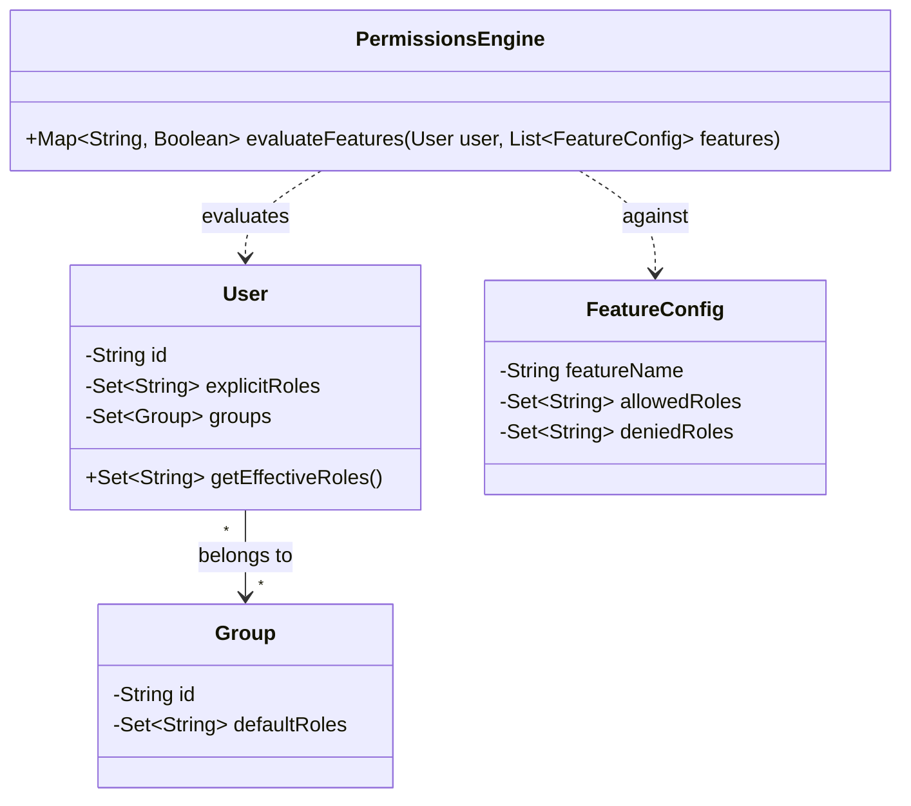
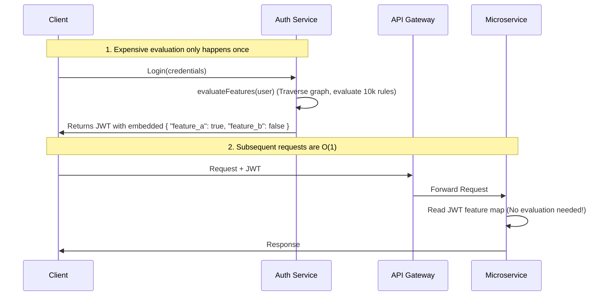

## The Polluted State Test Finder {#interview-polluted-state-test-finder}

### Metadata

- **Platform**: Interview
- **Difficulty**: Medium
- **Tags**: Binary Search, Divide and Conquer, Systems Design
- **Techniques**: [Binary Search](#glossary-binary-search)

### Problem Statement

You are given a suite of unit tests that run sequentially. We have noticed a strange behavior: when the entire suite runs, the very last test in the suite (the `target_test`) fails. However, if you run the `target_test` completely by itself, it passes.

This means one of the preceding tests is mutating a global state (like a database, environment variable, or cache) and not cleaning up after itself, which sabotages the final test.

Assume exactly one preceding test is the culprit. You are provided a helper function `runTests(test_list)` which takes a list of tests, executes them in order in a fresh environment, and returns `true` if they all pass, or `false` if there is a failure.

**Goal**: Write a function to find the index of the bad test. Since running tests is expensive, you must find the culprit making the minimum possible number of calls to `runTests()`.

### Core Idea

Linear execution takes $O(N)$ calls, but appending the target test to halves of the search space reduces this to $O(\log N)$ calls. This is a classic application of **Binary Search**.

### Walkthrough & Implementation - Iterative Solution

The candidate should recognize that running tests one by one takes $O(N)$ executions. By splitting the tests in half and appending the `target_test`, they can eliminate half of the search space with each execution, reducing the time complexity to $O(\log N)$.

```java
public int findPollutingTest(List<Integer> tests, Function<List<Integer>, Boolean> runTests) {
    int targetTest = tests.get(tests.size() - 1);
    int left = 0;
    int right = tests.size() - 2;

    while (left < right) {
        int mid = left + (right - left) / 2;
        
        List<Integer> testChunk = new ArrayList<>(tests.subList(left, mid + 1));
        testChunk.add(targetTest);

        if (!runTests.apply(testChunk)) {
            right = mid;
        } else {
            left = mid + 1;
        }
    }
    return left;
}
```

```go
func FindPollutingTest(tests []int, runTests func([]int) bool) int {
	targetTest := tests[len(tests)-1]
	left := 0
	right := len(tests) - 2

	for left < right {
		mid := left + (right-left)/2
		
		// Construct the test execution slice
		testChunk := make([]int, 0, mid-left+2)
		testChunk = append(testChunk, tests[left:mid+1]...)
		testChunk = append(testChunk, targetTest)

		if !runTests(testChunk) {
			right = mid
		} else {
			left = mid + 1
		}
	}
	return left
}
```

### Walkthrough & Implementation - Recursive Solution

While the iterative solution is preferred for $O(1)$ space, here is the equivalent recursive approach to demonstrate how to pass the search boundaries down the call stack.

```java
public int findPollutingTestRecursive(List<Integer> tests, Function<List<Integer>, Boolean> runTests) {
    int targetTest = tests.get(tests.size() - 1);
    return search(tests, targetTest, 0, tests.size() - 2, runTests);
}

private int search(List<Integer> tests, int targetTest, int left, int right, Function<List<Integer>, Boolean> runTests) {
    if (left >= right) {
        return left;
    }
    
    int mid = left + (right - left) / 2;
    List<Integer> testChunk = new ArrayList<>(tests.subList(left, mid + 1));
    testChunk.add(targetTest);
    
    if (!runTests.apply(testChunk)) {
        return search(tests, targetTest, left, mid, runTests);
    } else {
        return search(tests, targetTest, mid + 1, right, runTests);
    }
}
```

```go
func FindPollutingTestRecursive(tests []int, runTests func([]int) bool) int {
	targetTest := tests[len(tests)-1]
	
	var search func(left, right int) int
	search = func(left, right int) int {
		if left >= right {
			return left
		}
		
		mid := left + (right-left)/2
		testChunk := make([]int, 0, mid-left+2)
		testChunk = append(testChunk, tests[left:mid+1]...)
		testChunk = append(testChunk, targetTest)
		
		if !runTests(testChunk) {
			return search(left, mid)
		}
		return search(mid+1, right)
	}
	
	return search(0, len(tests)-2)
}
```


### Follow-up Questions

| Follow-Up | Difficulty | Focus |
|---|---|---|
| 1. Space Complexity | Easy | Recursive vs. Iterative tradeoffs, call stack limits |
| 2. Multiple Polluting Tests | Medium | Divide and Conquer algorithm, time complexity |
| 3. The Flaky Polluter | Hard | Probabilistic thinking, retry logic, confidence intervals |
| 4. Applied Engineering | Medium | Threads vs. Subprocesses, Memory Isolation, OS exit codes |
| 5. Unit-Testable Code | Medium | Writing unit-testable code, Dependency Injection |

#### Follow-Up 1: Iterative vs. Recursive Space Complexity

**Question**: "You wrote this solution iteratively. If you wrote it recursively, how would the space complexity change, and why?"

**Expected Answer**: The iterative approach is $O(1)$ space because it only stores integer pointers (`left`, `right`, `mid`). A recursive approach would be $O(\log N)$ space because each recursive function call adds a new frame to the call stack.

**Bonus (Real-World Application)**: Ask if they would be worried about a Stack Overflow error with recursion here. A strong engineer will realize that because $\log_2(N)$ grows so slowly, even a suite of 1,000,000 tests would only result in a maximum call stack depth of ~20, meaning a stack overflow is practically impossible. For context, modern runtimes have significantly higher limits: Python defaults to 1,000, Java and JavaScript typically allow ~10,000 frames, and Go dynamically grows its stack to accommodate millions of frames.

#### Follow-Up 2: Multiple Polluting Tests

**Question**: "What if there are multiple independent tests that pollute the state? The standard binary search only guarantees finding one of them. How would you modify your approach to find ALL polluting tests efficiently?"

**Expected Answer**: They need to pivot from a standard Binary Search to a Divide and Conquer algorithm. They should test a segment of tests; if it passes, they can prune that entire branch. If it fails, they must recursively search both the left and right halves. 

Time Complexity: This changes the execution count from $O(\log N)$ to $O(k \log N)$, where $k$ is the number of polluting tests.

```java
public List<Integer> findAllPollutingTests(List<Integer> tests, Function<List<Integer>, Boolean> runTests) {
    int targetTest = tests.get(tests.size() - 1);
    List<Integer> results = new ArrayList<>();
    
    searchAll(tests, targetTest, 0, tests.size() - 2, runTests, results);
    return results;
}

private void searchAll(List<Integer> tests, int targetTest, int left, int right, Function<List<Integer>, Boolean> runTests, List<Integer> results) {
    if (left > right) {
        return;
    }
    
    List<Integer> testChunk = new ArrayList<>(tests.subList(left, right + 1));
    testChunk.add(targetTest);
    
    // Prune branch if the entire block passes
    if (runTests.apply(testChunk)) {
        return;
    }
    
    // If it failed and we're down to one test, we found a culprit
    if (left == right) {
        results.add(left);
        return;
    }
    
    // Otherwise, split and search both halves
    int mid = left + (right - left) / 2;
    searchAll(tests, targetTest, left, mid, runTests, results);
    searchAll(tests, targetTest, mid + 1, right, runTests, results);
}
```

```go
func FindAllPollutingTests(tests []int, runTests func([]int) bool) []int {
	target := tests[len(tests)-1]
	var results []int

	var search func(left, right int)
	search = func(left, right int) {
		if left > right {
			return
		}

		chunk := append(append([]int{}, tests[left:right+1]...), target)
		
		// Prune branch if it passes
		if runTests(chunk) {
			return
		}

		// Found a polluter
		if left == right {
			results = append(results, left)
			return
		}

		mid := left + (right-left)/2
		search(left, mid)
		search(mid+1, right)
	}

	search(0, len(tests)-2)
	return results
}
```

#### Follow-Up 3: The Flaky Polluter (Probabilistic)

**Question**: "The polluting test introduces a race condition. When you run the culprit test followed by the target test, the target test only fails 60% of the time. If a chunk passes, it might just be a lucky run (false negative). How do you adjust your algorithm?"

**Expected Answer**: Introduce a retry loop. Never retry failures (a single failure is definitive proof). Only retry passes to gain statistical confidence.

**Probability Math**: To be $>99\%$ confident, the probability of $K$ consecutive false negatives is $0.40^K < 0.01$. This requires $K = 5$ retries.

```java
public int findFlakyTest(List<Integer> tests, Function<List<Integer>, Boolean> runTests, int retryLimit) {
    int target = tests.get(tests.size() - 1);
    int left = 0;
    int right = tests.size() - 2;

    while (left < right) {
        int mid = left + (right - left) / 2;
        List<Integer> chunk = new ArrayList<>(tests.subList(left, mid + 1));
        chunk.add(target);

        boolean chunkFailed = false;
        for (int i = 0; i < retryLimit; i++) {
            if (!runTests.apply(chunk)) {
                chunkFailed = true;
                break;
            }
        }

        if (chunkFailed) {
            right = mid;
        } else {
            left = mid + 1;
        }
    }
    return left;
}
```

```go
func FindFlakyTest(tests []int, runTests func([]int) bool, retryLimit int) int {
	target := tests[len(tests)-1]
	left := 0
	right := len(tests) - 2

	for left < right {
		mid := left + (right-left)/2
		
		chunk := make([]int, 0, mid-left+2)
		chunk = append(chunk, tests[left:mid+1]...)
		chunk = append(chunk, target)

		chunkFailed := false
		for i := 0; i < retryLimit; i++ {
			if !runTests(chunk) {
				chunkFailed = true
				break
			}
		}

		if chunkFailed {
			right = mid
		} else {
			left = mid + 1
		}
	}
	return left
}
```

#### Follow-Up 4: Applied Engineering (Subprocess vs. Thread)

**Question**: "You are building this logic into a real CLI tool. To implement `run_tests(test_chunk)`, you need to execute a test runner (like Pytest, Jest, or Go test) programmatically. Would you execute the test runner by spawning a new **Thread** or by spawning a new **Subprocess**? Why?"

**Expected Answer**: A strong candidate will immediately recognize that they **must use a Subprocess**, and should articulate these core reasons:

1. **Memory Isolation (The Core Problem)**: Threads share the same memory space. The entire premise of this problem is that tests are mutating global state! If we run the test chunks in a Thread, they will pollute the memory of our actual CLI tool, and consecutive test runs will pollute each other. Spawning a new Subprocess guarantees a completely fresh memory space (a fresh heap) for every execution.
2. **Executable Boundaries**: CLI test runners are designed as standalone executables. They expect to boot up their own environment, read environment variables, and tear down. You interact with them at the OS level, which requires a child process.
3. **Parsing Results via Exit Codes**: By using a Subprocess, we don't have to parse brittle console output (`stdout`). We can simply read the standard OS exit code of the child process. If the subprocess exits with `0`, the test chunk passed. If it exits with a non-zero code (like `1`), the chunk failed.

#### Follow-Up 5: Architecture & Unit-Testable Code

**Question**: "Below is application code using a Singleton/Global State pattern. `test_feature_flag()` passes alone. `test_default_secure()` passes alone. Sequentially, the second fails. Why? Refactor the application code using Dependency Injection to fix this."

```java
// Flawed Singleton Approach
public class SecurityConfig {
    private static SecurityConfig instance = new SecurityConfig();
    public boolean allowGuestAccess = false;
    
    public static SecurityConfig getInstance() {
        return instance;
    }
}

public void grantTemporaryAccess() {
    SecurityConfig.getInstance().allowGuestAccess = true;
}

// Tests share global state
public void testFeatureFlagToggle() {
    grantTemporaryAccess();
    assert SecurityConfig.getInstance().allowGuestAccess == true;
}

public void testDefaultSecure() {
    // If run after testFeatureFlagToggle, this will fail!
    assert SecurityConfig.getInstance().allowGuestAccess == false;
}
```

```go
// Flawed Global State Approach
type SecurityConfig struct {
    AllowGuestAccess bool
}

// Global shared state
var GlobalConfig = &SecurityConfig{AllowGuestAccess: false}

func GrantTemporaryAccess() {
    GlobalConfig.AllowGuestAccess = true
}

// Tests share global state
func TestFeatureFlagToggle(t *testing.T) {
    GrantTemporaryAccess()
    // assert GlobalConfig.AllowGuestAccess == true
}

func TestDefaultSecure(t *testing.T) {
    // If run after TestFeatureFlagToggle, this will fail!
    // assert GlobalConfig.AllowGuestAccess == false
}
```

**The Flawed Concept**: The application relies on a static, globally shared instance of `SecurityConfig`. The first test mutates this instance, polluting the memory state for the second test.

**The Refactor (Dependency Injection)**: The candidate must strip out the static instance logic and pass the configuration object into the functions that need it. Tests should inject a fresh config every time.

```java
// Refactor using Dependency Injection
public class SecurityConfig {
    public boolean allowGuestAccess = false;
}

public void grantTemporaryAccess(SecurityConfig config) {
    config.allowGuestAccess = true;
}

// Tests inject a fresh struct every time
public void testFeatureFlagToggle() {
    SecurityConfig testConfig = new SecurityConfig();
    grantTemporaryAccess(testConfig);
    assert testConfig.allowGuestAccess == true;
}
```

```go
type SecurityConfig struct {
    AllowGuestAccess bool
}

// Pass by pointer to inject dependency
func GrantTemporaryAccess(cfg *SecurityConfig) {
    cfg.AllowGuestAccess = true
}

// Tests inject a fresh struct every time
func TestFeatureFlagToggle(t *testing.T) {
    cfg := &SecurityConfig{AllowGuestAccess: false}
    GrantTemporaryAccess(cfg)
    // assert cfg.AllowGuestAccess == true
}
```

## AST Linter & The Visitor Pattern {#interview-ast-linter}

### Metadata

- **Platform**: Interview
- **Difficulty**: Medium / Hard
- **Tags**: N-ary Tree, DFS, Design Patterns, Visitor Pattern
- **Techniques**: [Depth-First Search](#glossary-dfs)

### Problem Statement

You are building a lightweight code linter. The source code has already been parsed into an Abstract Syntax Tree (AST). Each `Node` has a `type` (e.g., `"VariableDeclaration"`, `"FunctionCall"`) and an arbitrary number of `children` nodes.

**Goal**: Write a function `findNodes(root, targetType)` that traverses the AST and returns a list of all nodes matching the `targetType`.

### Core Idea

This is a classic N-ary tree traversal. Because we need to explore all branches to find matching nodes, we can use Depth-First Search (DFS). We will implement this both recursively and iteratively.

### Walkthrough & Implementation - Recursive vs. Iterative

A strong candidate will quickly implement a recursive DFS. However, recursive solutions are vulnerable to Stack Overflow errors if the AST is extremely deep (e.g., deeply chained method calls like `obj.do().do().do()...`). 

The interviewer should prompt the candidate to rewrite the solution iteratively using an explicit Stack, which moves the memory footprint from the call stack to the heap.

```java
class ASTNode {
    String type;
    List<ASTNode> children;
    
    public ASTNode(String type) {
        this.type = type;
        this.children = new ArrayList<>();
    }
}

class Linter {
    // 1. Recursive Approach
    public List<ASTNode> findNodesRecursive(ASTNode root, String targetType) {
        List<ASTNode> result = new ArrayList<>();
        if (root == null) return result;
        
        if (root.type.equals(targetType)) {
            result.add(root);
        }
        
        for (ASTNode child : root.children) {
            result.addAll(findNodesRecursive(child, targetType));
        }
        
        return result;
    }
    
    // 2. Iterative Approach (Heap-based Stack)
    public List<ASTNode> findNodesIterative(ASTNode root, String targetType) {
        List<ASTNode> result = new ArrayList<>();
        if (root == null) return result;
        
        Stack<ASTNode> stack = new Stack<>();
        stack.push(root);
        
        while (!stack.isEmpty()) {
            ASTNode curr = stack.pop();
            
            if (curr.type.equals(targetType)) {
                result.add(curr);
            }
            
            // Push children in reverse order to maintain left-to-right traversal
            for (int i = curr.children.size() - 1; i >= 0; i--) {
                stack.push(curr.children.get(i));
            }
        }
        
        return result;
    }
}
```

```go
type ASTNode struct {
	Type     string
	Children []*ASTNode
}

// 1. Recursive Approach
func FindNodesRecursive(root *ASTNode, targetType string) []*ASTNode {
	var result []*ASTNode
	if root == nil {
		return result
	}

	if root.Type == targetType {
		result = append(result, root)
	}

	for _, child := range root.Children {
		result = append(result, FindNodesRecursive(child, targetType)...)
	}

	return result
}

// 2. Iterative Approach (Heap-based Slice Stack)
func FindNodesIterative(root *ASTNode, targetType string) []*ASTNode {
	var result []*ASTNode
	if root == nil {
		return result
	}

	stack := []*ASTNode{root}

	for len(stack) > 0 {
		// Pop
		curr := stack[len(stack)-1]
		stack = stack[:len(stack)-1]

		if curr.Type == targetType {
			result = append(result, curr)
		}

		// Push children in reverse order
		for i := len(curr.Children) - 1; i >= 0; i-- {
			stack = append(stack, curr.Children[i])
		}
	}

	return result
}
```

### Follow-up Questions

| Follow-Up | Difficulty | Focus |
|---|---|---|
| 1. The "Many Strategies" Problem | Medium | System Design, Visitor Pattern, Code Duplication |
| 2. Scoping and State | Hard | Pre-order vs Post-order hooks, Stack memory management |

#### Follow-Up 1: The "Many Strategies" Problem (Architecture)

**Scenario**: Your linter becomes wildly successful. You now have 50 different linting rules. One rule looks for unused variables, another looks for deprecated function calls, and another calculates cyclomatic complexity. 

**Question**: If we write 50 different `findNodes`-style traversal functions, we are traversing the entire AST 50 times, and we are duplicating the tree-walking logic 50 times. How would you architect the system so that we only traverse the tree **exactly once**, but apply all 50 rules independently?

**Expected Answer**: The candidate should pivot to the **Visitor Pattern** (or an event-driven Pub/Sub model). We write a single generic `traverse(root, visitors)` function. As the traverser visits each node, it triggers `visitor.visit(node)` on all registered plugins. This separates the *traversal logic* from the *business logic*.

```java
// The decoupled architecture
interface ASTVisitor {
    void visit(ASTNode node);
}

class TraversalEngine {
    List<ASTVisitor> visitors = new ArrayList<>();
    
    public void register(ASTVisitor visitor) {
        visitors.add(visitor);
    }
    
    public void traverse(ASTNode root) {
        if (root == null) return;
        
        // Broadcast to all plugins
        for (ASTVisitor visitor : visitors) {
            visitor.visit(root);
        }
        
        for (ASTNode child : root.children) {
            traverse(child);
        }
    }
}
```

```go
type ASTVisitor interface {
	Visit(node *ASTNode)
}

type TraversalEngine struct {
	visitors []ASTVisitor
}

func (e *TraversalEngine) Register(v ASTVisitor) {
	e.visitors = append(e.visitors, v)
}

func (e *TraversalEngine) Traverse(root *ASTNode) {
	if root == nil {
		return
	}

	// Broadcast to all plugins
	for _, v := range e.visitors {
		v.Visit(root)
	}

	for _, child := range root.Children {
		e.Traverse(child)
	}
}
```

#### Follow-Up 2: Scoping and State (Enter vs. Exit)

**Scenario**: One of your plugins checks for variable shadowing (re-declaring a variable in a nested scope). To do this, the plugin needs to know what variables are currently in scope.

**Question**: Standard DFS just "visits" a node once. How does your traversal algorithm need to change to support entering and exiting blocks of code (like `{ ... }`) so plugins can manage scope?

**Expected Answer**: The traversal needs **Pre-order (Enter)** and **Post-order (Exit)** hooks. The `traverse` function should call `visitor.enterNode(node)`, then recursively visit children, and finally call `visitor.exitNode(node)`. 

This allows the plugin to push a new scope (symbol table) onto its own stack when entering a `BlockStatement`, and pop it off when exiting, perfectly mirroring the AST's lexical scoping.

## The Microservice Deadlock {#interview-microservice-deadlock}

### Metadata

- **Platform**: Interview
- **Difficulty**: Hard
- **Tags**: Graph, DFS, Cycle Detection
- **Techniques**: [Depth-First Search](#glossary-dfs), [Topological Sort](#glossary-topological-sort)

### Problem Statement

You are building the orchestration engine for a cluster. Services can declare startup dependencies on other services (e.g., `AuthService` must start before `PaymentService`). 

If a dependency chain loops back on itself (e.g., A $\to$ B $\to$ C $\to$ A), the cluster will deadlock indefinitely during startup. 

**Goal**: Given a list of services and their dependencies, write a function that returns `true` if a deadlock (cycle) exists, and `false` if the cluster can start safely.

### Core Idea

A naive Depth-First Search (DFS) with a simple `visited` set will fail here. It might incorrectly flag "diamond dependencies" (A $\to$ B $\to$ D and A $\to$ C $\to$ D) as a cycle, or it might run infinitely. 

The standard approach to directed graph cycle detection requires a **3-State DFS** (also known as vertex coloring). Nodes are marked as:
- `0 (Unvisited)`: Not yet explored.
- `1 (Visiting)`: Currently on the DFS recursion stack. If we encounter a `1` while traversing, we've found a cycle!
- `2 (Safe/Visited)`: Fully explored, and no cycles exist downstream.

### Walkthrough & Implementation

The candidate should build an adjacency list representing the graph, then iterate through every node, launching a DFS if the node is unvisited. 

```java
public class DeadlockDetector {
    // 0 = Unvisited, 1 = Visiting, 2 = Safe
    public boolean hasDeadlock(int numServices, int[][] dependencies) {
        List<List<Integer>> graph = new ArrayList<>();
        for (int i = 0; i < numServices; i++) {
            graph.add(new ArrayList<>());
        }
        
        for (int[] dep : dependencies) {
            int service = dep[0];
            int dependsOn = dep[1];
            graph.get(service).add(dependsOn);
        }
        
        int[] state = new int[numServices];
        
        for (int i = 0; i < numServices; i++) {
            if (state[i] == 0) {
                if (dfs(i, graph, state)) {
                    return true; // Cycle detected
                }
            }
        }
        
        return false;
    }
    
    private boolean dfs(int curr, List<List<Integer>> graph, int[] state) {
        if (state[curr] == 1) return true;  // Hit a node currently on the stack -> Cycle!
        if (state[curr] == 2) return false; // Already verified safe
        
        state[curr] = 1; // Mark as Visiting
        
        for (int neighbor : graph.get(curr)) {
            if (dfs(neighbor, graph, state)) {
                return true;
            }
        }
        
        state[curr] = 2; // Mark as Safe
        return false;
    }
}
```

```go
func HasDeadlock(numServices int, dependencies [][]int) bool {
	graph := make([][]int, numServices)
	for _, dep := range dependencies {
		service, dependsOn := dep[0], dep[1]
		graph[service] = append(graph[service], dependsOn)
	}

	// 0 = Unvisited, 1 = Visiting, 2 = Safe
	state := make([]int, numServices)

	var dfs func(curr int) bool
	dfs = func(curr int) bool {
		if state[curr] == 1 {
			return true // Hit a node currently on the stack -> Cycle!
		}
		if state[curr] == 2 {
			return false // Already verified safe
		}

		state[curr] = 1 // Mark as Visiting

		for _, neighbor := range graph[curr] {
			if dfs(neighbor) {
				return true
			}
		}

		state[curr] = 2 // Mark as Safe
		return false
	}

	for i := 0; i < numServices; i++ {
		if state[i] == 0 {
			if dfs(i) {
				return true
			}
		}
	}

	return false
}
```

### Follow-up Questions

| Follow-Up | Difficulty | Focus |
|---|---|---|
| 1. Path Reconstruction | Medium | Stack manipulation, developer experience |
| 2. Container Fallbacks | Hard | AND/OR Graphs, aggregations, boolean logic |
| 3. Soft Dependencies | Easy/Medium | Cycle-breaking heuristics, graph filtering |

#### Follow-Up 1: Path Reconstruction

**Question**: "Just returning `true` isn't helpful for the engineers debugging the deadlock. Modify your algorithm to return the exact chain of dependencies that caused the loop (e.g., `[A, B, C, A]`)."

**Expected Answer**: 
The candidate needs to actively maintain the current path in an array or stack as they traverse down. When the cycle is hit (encountering state `1`), they can slice or copy the stack from the first occurrence of the looped node to the end, giving the exact cycle path.

#### Follow-Up 2: Container Fallbacks (AND/OR Graphs)

**Scenario**: A microservice is no longer just one block of code; it is composed of multiple containers for high availability (e.g., Service A has containers A.1 and A.2). 
- A **Container** can only start if **ALL** of its dependencies start. 
- A **Service** is considered "started" if **ANY** of its containers successfully start (acting as fallbacks).

**Question**: "How does this change your deadlock detection? What if Container A.1 creates a dependency cycle, but Container A.2 does not?"

**Expected Answer**: 
This upgrades the problem from a standard Directed Graph to an **AND/OR Graph**. A global deadlock only occurs if a service is *completely* blocked from starting.
- **Containers are AND nodes**: If *any* of a container's dependencies are deadlocked, the container is deadlocked.
- **Services are OR nodes**: If *all* of a service's containers are deadlocked, the service is deadlocked. If even one container can start safely, the service is safe. 
The DFS algorithm must be split into two alternating functions (`dfsService` and `dfsContainer`), using `&&` aggregations for Services and `||` aggregations for Containers.

#### Follow-Up 3: Soft vs. Hard Dependencies

**Scenario**: Sometimes cycles are unavoidable in legacy architectures, but not all dependencies are strictly required. Some are "Hard" (the service crashes without it), and some are "Soft" (the service boots with degraded features).

**Question**: "Assume each dependency edge is marked with a boolean `is_hard_requirement`. How would you determine if the cluster can auto-heal by dropping a soft dependency to break the cycle?"

**Expected Answer**: 
The candidate should realize that a true, unresolvable deadlock only exists if a cycle is comprised *entirely* of Hard dependencies. If a cycle contains even one Soft dependency, the orchestrator can ignore that edge and boot the cluster. The simplest algorithmic change is to just filter out/ignore Soft edges during the graph traversal, effectively treating them as if they don't exist.

## Role-Based Feature Evaluator {#interview-feature-evaluator}

### Metadata

- **Platform**: Interview
- **Difficulty**: Easy
- **Tags**: Arrays, HashSets, Business Logic, RBAC
- **Techniques**: Hash Sets, Early Returns

### Problem Statement

You are writing the core permissions engine for an application. 
- You receive a `User` object that contains a list of `Roles` (e.g., `["editor", "viewer"]`).
- You have a list of `FeatureConfig` objects. Each config has a `FeatureName` and a list of `AllowedRoles`.

**The Rule**: A feature is enabled for a user if the user possesses at least one of the `AllowedRoles`.

**Goal**: Write a function `evaluateFeatures(User, List<FeatureConfig>)` that returns a Map/Dictionary of `FeatureName -> Boolean` (true if enabled, false if disabled).

### Core Idea

This problem tests a candidate's ability to choose the right data structure. A naive approach uses nested loops to check if a user's roles exist in the feature's allowed roles, leading to $O(N \times M)$ complexity. 

The optimal approach converts the user's roles into a `HashSet` once at the beginning of the function, allowing $O(1)$ constant-time lookups for every feature check.

### Walkthrough & Implementation

**Test Case**:
```json
Input: 
  User: { "roles": ["viewer", "tester"] }
  Features: [
    { "name": "dashboard", "allowedRoles": ["admin", "viewer"] },
    { "name": "delete_db", "allowedRoles": ["admin"] }
  ]
Output: 
  { "dashboard": true, "delete_db": false }
```

```java
import java.util.*;

class User {
    String id;
    List<String> roles;
    
    public User(String id, List<String> roles) {
        this.id = id;
        this.roles = roles;
    }
}

class FeatureConfig {
    String featureName;
    List<String> allowedRoles;
    
    public FeatureConfig(String name, List<String> roles) {
        this.featureName = name;
        this.allowedRoles = roles;
    }
}

class PermissionsEngine {
    public Map<String, Boolean> evaluateFeatures(User user, List<FeatureConfig> features) {
        Map<String, Boolean> results = new HashMap<>();
        
        // Convert user roles to a HashSet for O(1) lookups
        Set<String> userRolesSet = new HashSet<>(user.roles);
        
        for (FeatureConfig feature : features) {
            boolean isEnabled = false;
            
            for (String allowedRole : feature.allowedRoles) {
                if (userRolesSet.contains(allowedRole)) {
                    isEnabled = true;
                    break; // No need to check other roles for this feature
                }
            }
            
            results.put(feature.featureName, isEnabled);
        }
        
        return results;
    }
}
```

```go
type User struct {
	ID    string
	Roles []string
}

type FeatureConfig struct {
	FeatureName  string
	AllowedRoles []string
}

func EvaluateFeatures(user User, features []FeatureConfig) map[string]bool {
	results := make(map[string]bool)

	// Convert user roles to a hash set for O(1) lookups
	userRolesSet := make(map[string]bool)
	for _, role := range user.Roles {
		userRolesSet[role] = true
	}

	for _, feature := range features {
		isEnabled := false
		
		for _, allowedRole := range feature.AllowedRoles {
			if userRolesSet[allowedRole] {
				isEnabled = true
				break // No need to check other roles for this feature
			}
		}
		
		results[feature.FeatureName] = isEnabled
	}

	return results
}
```

### Follow-up Questions

| Follow-Up | Difficulty | Focus |
|---|---|---|
| 1. The "Deny" Override | Easy | Business Logic, Precedence rules |
| 2. Class Design (Composition vs Inheritance) | Medium | Domain modeling, IAM design |
| 3. Composite Roles | Hard | Tree/Graph Traversal, BFS/DFS |
| 4. Performance at Scale | Medium | Caching, JWTs, System Design |

#### Follow-Up 1: The "Deny" Override (Precedence)

**Scenario**: We need to explicitly ban certain problematic roles from a feature, even if they possess an allowed role. We add a `DeniedRoles` list to the `FeatureConfig`.

**Question**: "How do you implement this, and what is the order of precedence between Allow and Deny?"

**Expected Answer**: 
Security best practices dictate that **Deny always overrides Allow**. The candidate must update their logic to check the `DeniedRoles` *first*. If a user possesses a denied role, the loop should instantly return `false` before even checking the allowed conditions.

**Test Case**:
```json
Input: 
  User: { "roles": ["viewer", "contractor"] }
  Features: [
    { "name": "dashboard", "allowedRoles": ["viewer"], "deniedRoles": ["contractor"] }
  ]
Output: 
  { "dashboard": false } // Deny overrides Allow
```

```java
class PermissionsEngine {
    public Map<String, Boolean> evaluateFeatures(User user, List<FeatureConfig> features) {
        Map<String, Boolean> results = new HashMap<>();
        Set<String> userRolesSet = new HashSet<>(user.roles);
        
        for (FeatureConfig feature : features) {
            boolean isDenied = false;
            
            // 1. Check Deny FIRST
            for (String deniedRole : feature.deniedRoles) {
                if (userRolesSet.contains(deniedRole)) {
                    isDenied = true;
                    break;
                }
            }
            
            if (isDenied) {
                results.put(feature.featureName, false);
                continue; // Move to the next feature immediately
            }
            
            // 2. Check Allow ONLY if not denied
            boolean isEnabled = false;
            for (String allowedRole : feature.allowedRoles) {
                if (userRolesSet.contains(allowedRole)) {
                    isEnabled = true;
                    break; 
                }
            }
            
            results.put(feature.featureName, isEnabled);
        }
        
        return results;
    }
}
```

```go
func EvaluateFeatures(user User, features []FeatureConfig) map[string]bool {
	results := make(map[string]bool)

	userRolesSet := make(map[string]bool)
	for _, role := range user.Roles {
		userRolesSet[role] = true
	}

	for _, feature := range features {
		isDenied := false
		
		// 1. Check Deny FIRST
		for _, deniedRole := range feature.DeniedRoles {
			if userRolesSet[deniedRole] {
				isDenied = true
				break
			}
		}
		
		if isDenied {
			results[feature.FeatureName] = false
			continue // Move to the next feature immediately
		}
		
		// 2. Check Allow ONLY if not denied
		isEnabled := false
		for _, allowedRole := range feature.AllowedRoles {
			if userRolesSet[allowedRole] {
				isEnabled = true
				break
			}
		}
		
		results[feature.FeatureName] = isEnabled
	}

	return results
}
```

#### Follow-Up 2: System Architecture (Composition vs. Inheritance)

**Scenario**: The business requirements have expanded. We are introducing the concept of **Groups** (e.g., "Beta Testers"). A Group has a set of `defaultRoles`. A `User` can belong to multiple groups, and their effective roles are a combination of their explicitly assigned roles and their groups' default roles. 

Furthermore, we now have three distinct types of entities making API requests:
1.  **Regular Users**: Standard humans.
2.  **System Users (Bots)**: Automated services that need specific, hardcoded automation roles.
3.  **Super Admins**: Users who inherently possess the highest privileges (e.g., the `"super_admin"` role).

**Question**: "How would you design the class structures to support Groups? Furthermore, how would you model System Users and Super Admins within this system? Can you draw a class diagram?"

**Expected Answer**: 
A naive candidate will immediately jump to **Inheritance** (e.g., creating `class SystemUser extends User`, `class SuperAdmin extends User`, each overriding the `getRoles()` method). 

The interviewer should guide them toward **Composition over Inheritance**. A strong candidate will realize that they don't need subclasses at all. Instead, they can model `SystemUsers` and `SuperAdmins` simply as **Groups**. 
- A Group holds a `Set<String> defaultRoles`.
- A User holds a `Set<String> explicitRoles` and a `Set<Group> groups`.

To find a User's effective roles, the `User` class itself simply unions its explicit roles with the default roles of all its assigned groups. For example, a Super Admin is just a standard `User` who happens to belong to the "SuperAdmin" group (which grants the `"super_admin"` role).



**Implementation Details**:
By pushing the role aggregation inside the `User` class, the `PermissionsEngine` remains perfectly clean and decoupled from user types.

**Test Case**:
```json
Input: 
  Groups: [
    { "id": "beta_testers", "defaultRoles": ["beta_feature"] },
    { "id": "super_admins", "defaultRoles": ["super_admin"] }
  ]
  Users: 
    - RegularUser: { "explicitRoles": ["viewer"], "groups": ["beta_testers"] }
    - SuperAdminUser: { "explicitRoles": [], "groups": ["super_admins"] }
  Features: [
    { "name": "new_ui", "allowedRoles": ["beta_feature"] },
    { "name": "delete_db", "allowedRoles": ["admin"] }
  ]

Output:
  RegularUser -> { "new_ui": true, "delete_db": false }
  SuperAdminUser -> { "new_ui": true, "delete_db": true } // super_admin short-circuits to true
```

```java
class User {
    public String id;
    public Set<String> explicitRoles;
    public Set<Group> groups;

    public Set<String> getEffectiveRoles() {
        Set<String> effective = new HashSet<>(explicitRoles);
        for (Group g : groups) {
            effective.addAll(g.defaultRoles);
        }
        return effective;
    }
}

class PermissionsEngine {
    public Map<String, Boolean> evaluateFeatures(User user, List<FeatureConfig> features) {
        Map<String, Boolean> results = new HashMap<>();
        Set<String> roles = user.getEffectiveRoles(); // Evaluated once!

        // SuperAdmin short-circuit
        if (roles.contains("super_admin")) {
            for (FeatureConfig f : features) results.put(f.featureName, true);
            return results; 
        }

        for (FeatureConfig feature : features) {
            // 1. Check Deny (using disjoint for clean Set intersection)
            if (!Collections.disjoint(roles, feature.deniedRoles)) {
                results.put(feature.featureName, false);
                continue;
            }

            // 2. Check Allow
            boolean isAllowed = !Collections.disjoint(roles, feature.allowedRoles);
            results.put(feature.featureName, isAllowed);
        }

        return results;
    }
}
```

```go
type Group struct {
	ID           string
	DefaultRoles []string
}

type User struct {
	ID            string
	ExplicitRoles []string
	Groups        []Group
}

func (u *User) GetEffectiveRoles() map[string]bool {
	effective := make(map[string]bool)
	for _, role := range u.ExplicitRoles {
		effective[role] = true
	}
	for _, g := range u.Groups {
		for _, role := range g.DefaultRoles {
			effective[role] = true
		}
	}
	return effective
}

func EvaluateFeatures(user User, features []FeatureConfig) map[string]bool {
	results := make(map[string]bool)
	roles := user.GetEffectiveRoles() // Evaluated once!

	// SuperAdmin short-circuit
	if roles["super_admin"] {
		for _, f := range features {
			results[f.FeatureName] = true
		}
		return results
	}

	for _, feature := range features {
		// 1. Check Deny
		isDenied := false
		for _, deniedRole := range feature.DeniedRoles {
			if roles[deniedRole] {
				isDenied = true
				break
			}
		}
		if isDenied {
			results[feature.FeatureName] = false
			continue
		}

		// 2. Check Allow
		isAllowed := false
		for _, allowedRole := range feature.AllowedRoles {
			if roles[allowedRole] {
				isAllowed = true
				break
			}
		}
		results[feature.FeatureName] = isAllowed
	}

	return results
}
```

#### Follow-Up 3: Composite Roles (Graph Traversal)

**Scenario**: We introduce the concept of "Composite Roles" (or Role Inheritance). A role can now implicitly include other roles. For example, the `admin` role includes the `editor` role, which includes the `viewer` role. If a user is granted `admin`, they should automatically have `editor` and `viewer` access.

**Question**: "Assuming you have access to a `RoleMap` that dictates which roles inherit which, how do you resolve a user's true effective roles?"

**Expected Answer**: 
This tests whether the candidate realizes the data structure has morphed into a Tree or a Directed Acyclic Graph (DAG). The candidate must use Breadth-First Search (BFS) or Depth-First Search (DFS) to expand the base roles. Crucially, they must track `visited` roles to prevent infinite loops if there is a cyclic inheritance bug in the database (e.g., Role A includes Role B, and Role B includes Role A).

> [!TIP]
> **Interviewer Tip (The Inheritance Trap)**: If a candidate tries to implement this using Class Inheritance (e.g., `class Admin extends Editor`), you should gently push back. Roles are *data*, not *application behavior*. If a system admin changes role hierarchies in a dashboard tomorrow, you shouldn't have to recompile the Java backend. The DAG Graph traversal approach allows roles to be dynamic data loaded from a database.

**Test Case**:
```json
Input:
  Base Roles: ["admin"]
  RoleGraph: {
    "admin": ["editor"],
    "editor": ["viewer", "commenter"]
  }
Output: 
  ["admin", "editor", "viewer", "commenter"]
```

```java
public Set<String> expandRoles(Set<String> baseRoles, Map<String, List<String>> roleGraph) {
    Set<String> effectiveRoles = new HashSet<>();
    Queue<String> queue = new LinkedList<>(baseRoles);
    
    // BFS Traversal
    while (!queue.isEmpty()) {
        String currentRole = queue.poll();
        
        // Track visited to prevent infinite cyclic loops
        if (effectiveRoles.contains(currentRole)) {
            continue;
        }
        
        effectiveRoles.add(currentRole);
        
        // Enqueue child roles
        List<String> inheritedRoles = roleGraph.get(currentRole);
        if (inheritedRoles != null) {
            queue.addAll(inheritedRoles);
        }
    }
    
    return effectiveRoles;
}
```

```go
func ExpandRoles(baseRoles []string, roleGraph map[string][]string) map[string]bool {
	effectiveRoles := make(map[string]bool)
	queue := append([]string{}, baseRoles...)
	
	// BFS Traversal
	for len(queue) > 0 {
		currentRole := queue[0]
		queue = queue[1:] // pop
		
		// Track visited to prevent infinite cyclic loops
		if effectiveRoles[currentRole] {
			continue
		}
		
		effectiveRoles[currentRole] = true
		
		// Enqueue child roles
		if inheritedRoles, exists := roleGraph[currentRole]; exists {
			queue = append(queue, inheritedRoles...)
		}
	}
	
	return effectiveRoles
}
```

#### Follow-Up 4: Performance at Scale

**Scenario**: This `evaluateFeatures` function is being called on every single API request for a massive application. We now have 10,000 features and complex group hierarchies. The CPU load is getting too high because the application evaluates the entire tree on every network call.

**Question**: "Without changing the core algorithm, how can we optimize this architecture so we don't have to calculate this on every request?"

**Expected Answer**: 
This is a shift from data structures to System Design. The candidate should recognize that feature evaluations are generally static for the duration of a session. They only depend on the user's roles, which are known at login. 

The optimization is **Caching at the edge or client**. We can evaluate the features exactly **once upon login**. We then embed the resulting Boolean permissions map directly into a signed JWT (JSON Web Token), or store it in a distributed cache like Redis keyed by a Session ID. Every subsequent API request simply reads the evaluated map without doing any graph traversal or loop checks.


